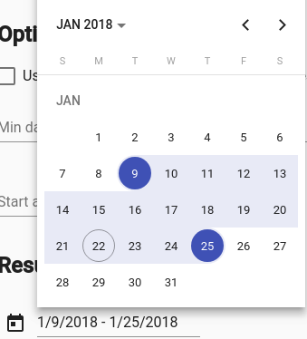

# Material range datepicker
Material datepicker with range support
## What is this?

This is patched version of Material Datepicker for Angular with range selection support.
I created this repository and this package due to it takes a lot of time to contribute to material2 repository.
[Issue in material2 repo.](https://github.com/angular/material2/issues/4763)

## [DEMO](https://stackblitz.com/edit/angular-4cfnyl)
## Advantages
1) You can change order of views: month, year and multi-year
2) You can keep calendar to be opened after selecting a date (in singular range mode) or a range of dates (in range mode)
3) **You can use all original material attributes: min, max, formControl and others**
 
## Changelog
## 7.0
Updated to angular material 7.1
## 6.1.1
Fixed a bug with ignoring `calendarHeaderComponent`
## 6.1.0
Merged #31
* Add option to sort views when clicking on period label button (month -> year or year -> month)
* Add option to enable closing datepicker after date selection #30 
## 6.0.5
Return back style files
## 6.0.4
The week for `pt-BR` starts from Sunday
## 6.0.2
* Updated to material datepicker 6.4.2
* Fixed the issue with `[value]` and `[formControl]` binding
* Added FAQ to popular questions
## 6.0.1
Updated to material datepicker 6.0.1
## 6.0.0
Styles included! Read below
## 1.1.7
Update to angular material 6.0.0 (2018/05/04)

## It's awesome, but how to use it?

As easy as pie.
Installation: `yarn add saturn-datepicker` or `npm install saturn-datepicker`
Import `SatDatepickerModule`, `SatNativeDateModule` and `MatDatepickerModule`
```angular2html
  <mat-form-field>
    <input matInput
        placeholder="Choose a date"
        [satDatepicker]="picker"
        [value]="date">
    <sat-datepicker #picker [rangeMode]="true"></sat-datepicker>
    <sat-datepicker-toggle matSuffix [for]="picker"></sat-datepicker-toggle>
  </mat-form-field>
```

Add styles:
* If you are using CSS: copy-paste or include somehow the file `saturn-datepicker/bundle.css`
* If you are using SCSS (preferable): 
```scss
@import '~saturn-datepicker/theming';
@include sat-datepicker-theme($theme); # material theme data structure https://material.angular.io/guide/theming#defining-a-custom-theme
```

## ngModel/formControl value have this interface:
```typescript
export interface SatDatepickerRangeValue<D> {
  begin: D | null;
  end: D | null;
}
```
## FAQ
### How to change date format or locale?
As same as for material, but with more code, just import constants from 'saturn-datepicker'.

Also you need to install `@angular/material-moment-adapter` package.
```
import { DateAdapter, MAT_DATE_FORMATS, MAT_DATE_LOCALE, SatDatepickerModule } from 'saturn-datepicker'
import { MAT_MOMENT_DATE_FORMATS, MomentDateAdapter } from '@angular/material-moment-adapter'


@NgModule({
    imports: [
        SatDatepickerModule,
    ],
    providers: [
        MyReportsService,
        {provide: DateAdapter, useClass: MomentDateAdapter, deps: [MAT_DATE_LOCALE]},
        {provide: MAT_DATE_FORMATS, useValue: MAT_MOMENT_DATE_FORMATS},
    ],
})
export class MyModule {
}

For advanced formatting, please look through material documentation.
```

### How to add option to sort views when clicking on period label button ?
`orderPeriodLabel` option sort the label period views.
- Default [multi-year]: multi-year then back to month
- Month [month]: month > year > multi-year

```angular2html
  <mat-form-field>
    <input matInput [satDatepicker]="resultPicker">
    <sat-datepicker
        #resultPicker
        [rangeMode]="true"
        orderPeriodLabel="month">
    </sat-datepicker>
   </mat-form-field>
```

### How disable closing datepicker after date selection ?
`closeAfterSelection` option enables or disables datepicker closing after date selections. By default the option is true

```angular2html
  <mat-form-field>
    <input matInput [satDatepicker]="resultPicker">
    <sat-datepicker
        #resultPicker
        [rangeMode]="true"
        [closeAfterSelection]="false">
    </sat-datepicker>
   </mat-form-field>
```

---
Licence: MIT

A little note for myself
```shell
npm run build:lib
cp saturn-datepicker/src/bundle.css saturn-datepicker/src/_theming.scss dist   
(cd dist ; npm pack)
(cd dist ; npm publish)
```
